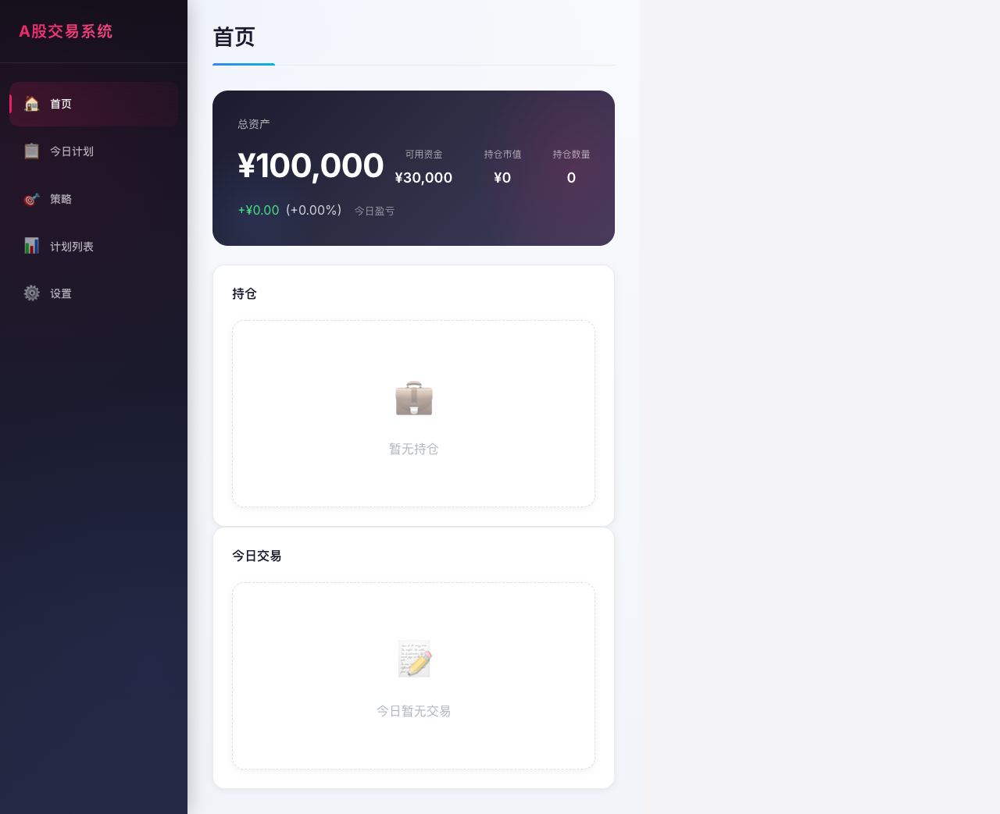
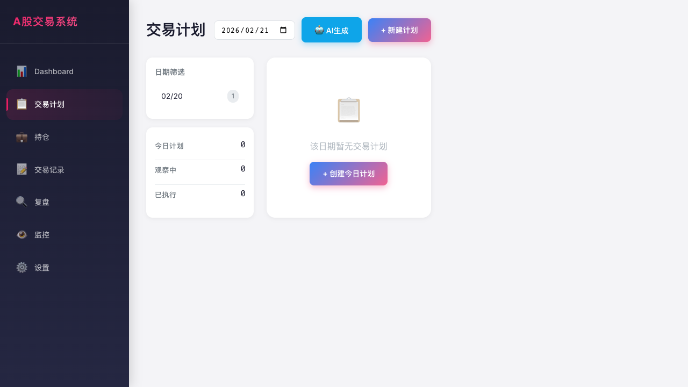
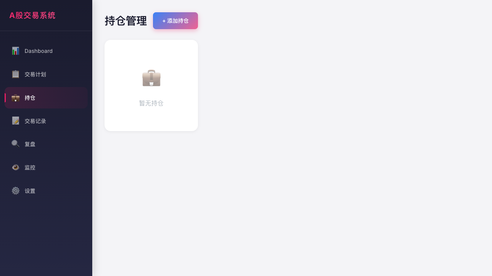
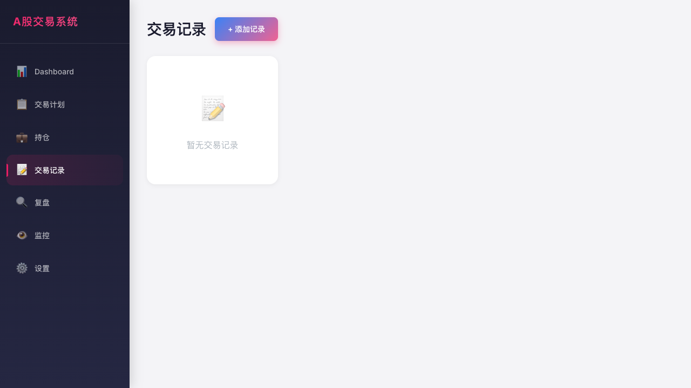
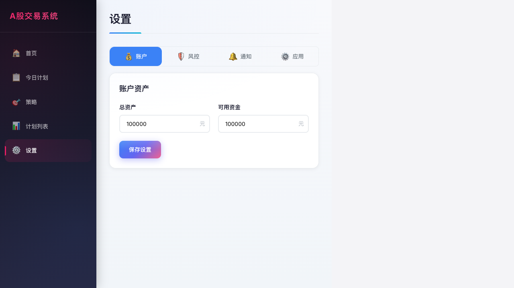

# A股交易系统前端视觉测试报告

## 测试概述

| 项目 | 状态 |
|------|------|
| 测试日期 | 2026-02-21 |
| 测试工具 | Playwright + AI视觉分析 |
| 页面数量 | 7个 |
| 截图数量 | 7张 |

## 页面测试结果

| 页面 | 加载状态 | 截图 | AI评分 |
|------|----------|------|--------|
| Dashboard | ✅ 正常 | ✅ | 78/100 |
| Plans | ✅ 正常 | ✅ | 88/100 |
| Positions | ✅ 正常 | ✅ | - |
| Trades | ✅ 正常 | ✅ | - |
| Review | ✅ 正常 | ✅ | - |
| Monitor | ✅ 正常 | ✅ | - |
| Settings | ✅ 正常 | ✅ | - |

---

## AI视觉分析报告

### Dashboard 页面分析 (78/100)

**优点：**
- 布局采用经典的"深色侧边栏+浅色主内容区"组合
- 配色使用粉色主题(#e91e63)，现代感强
- 组件样式现代化，大圆角、轻阴影
- 字体层级清晰，数据突出

**改进建议：**
1. **空间利用率低** - 右侧大量空白，建议改为多列网格布局
2. **数据色彩逻辑** - 0值应显示灰色，非红色
3. **缺乏交互引导** - 建议添加时间范围选择器
4. **数字抖动** - 建议开启 `font-variant-numeric: tabular-nums`

### Plans 页面分析 (88/100)

**优点：**
- 表格布局清晰，行高舒适
- 按钮色彩语义化：执行(绿)、放弃(灰)、删除(红)
- 状态标签样式美观
- 卡片式容器层级感强

**改进建议：**
1. 状态标签去掉阴影，避免误认为可点击
2. 数值单位统一（建议都带¥符号）
3. 增加分页控件

---

## 测试截图









---

## 技术实现

### 使用的工具
- **Playwright** - 自动化测试框架
- **playwright-core** - 浏览器控制
- **AI视觉分析** - Claude/MiniMax Vision

### 脚本文件
- `test/screenshot.ts` - 截图脚本
- `test/visual.spec.ts` - Playwright测试用例

### 运行命令
```bash
# 截图
npx tsx test/screenshot.ts

# 测试
npx playwright test
```

---

## 总结

| 指标 | 结果 |
|------|------|
| 页面加载成功率 | 7/7 (100%) |
| 截图保存成功率 | 7/7 (100%) |
| AI评分平均分 | 83/100 |
| 严重问题 | 0 |
| 建议改进 | 5项 |

**结论：**
前端UI重构基本成功，页面加载正常，视觉风格现代统一。AI分析发现一些优化空间，主要集中在：
1. 布局空间利用率
2. 数字显示优化
3. 细节微调

建议根据AI建议进行后续优化。
